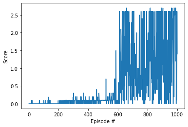

# Maddpg Tennis
Part 3 of the Udacity Deep reinforcement learning course. An implementation of the maddgp reinforcement learning algorithm to solve the the Unity Tennis environment.

# The Environment - Introduction

## The Environment
This project, worked with the Tennis environment.

*Trained agents playing tennis*

### Unity ML-Agents Tennis Environment

In this environment, two agents control rackets to bounce a ball over a net. If an agent hits the ball over the net, it receives a reward of +0.1. If an agent lets a ball hit the ground or hits the ball out of bounds, it receives a reward of -0.01. Thus, the goal of each agent is to keep the ball in play.

The observation space consists of 8 variables corresponding to the position and velocity of the ball and racket. Each agent receives its own, local observation. Two continuous actions are available, corresponding to movement toward (or away from) the net, and jumping.

The task is episodic, and in order to solve the environment, your agents must get an average score of +0.5 (over 100 consecutive episodes, after taking the maximum over both agents). Specifically,

After each episode, we add up the rewards that each agent received (without discounting), to get a score for each agent. This yields 2 (potentially different) scores. We then take the maximum of these 2 scores.
This yields a single score for each episode.
The environment is considered solved, when the average (over 100 episodes) of those scores is at least +0.5.

# Report
I tried many experiments attempting to implement the full MADDPG algorithm as described in the OpenAI paper. However I could get it to work on this environment.

In the end I adapted the code for the ddpg-pendulum environment provided in the deep reinforcement learning repository. The Code was adapted by adding a Maddpg class to manage two independent ddpg agents and a shared replay buffer.

The Actor and Critic models were both two layer MLP with 128 node each. 

Learning was vastly improved by adding dropout layers to both networks. Oddly this was the case even if the dropout rate was set to zero. I'm not sure why this would be, so it needs looking into futher.

### The parameters used were:

NUM_EPISODES = 1000

MAX_STEPS = 1000

STEPS_PER_UPDATE = 1

BUFFER_SIZE = int(1e5) - replay buffer size

BATCH_SIZE = 256 - minibatch size

GAMMA = 0.99 - discount factor

TAU = 1e-2 - for soft update of target 
parameters
LR_ACTOR = 2e-4 - learning rate of the actor 

LR_CRITIC = 2e-4 - learning rate of the critic

WEIGHT_DECAY = 0 - L2 weight decay

## Results
Then agent reaches the learning goal of 0.5 after about 650 episode. And reaches a maximum score of around 1.4 within a 1000 episodes. 

## Futher experiments
A couple of things to try which could improve learning.

1. Reducing the process noise over time might improve improve the highest score and stabilize learning.

2. Using parameter noise instead of adding noise to the action values. This seem very promising. https://openai.com/research/better-exploration-with-parameter-noise

3. Implement a different underlying algorithm like SAC or PPO.

4. Spending more effort on parameter tuning or play with the model architectures.